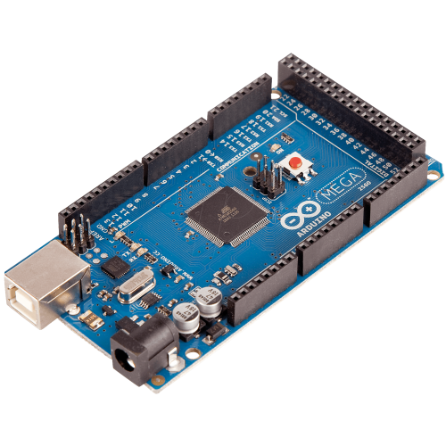
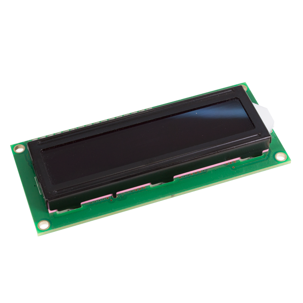
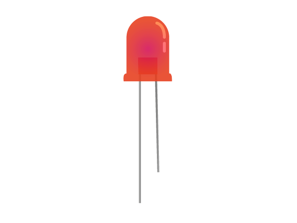
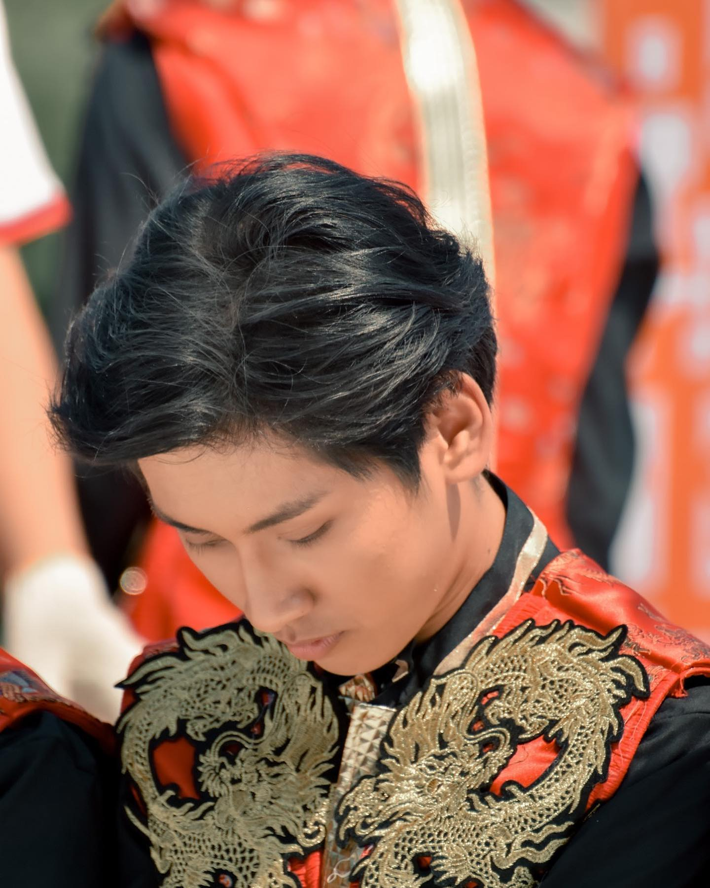
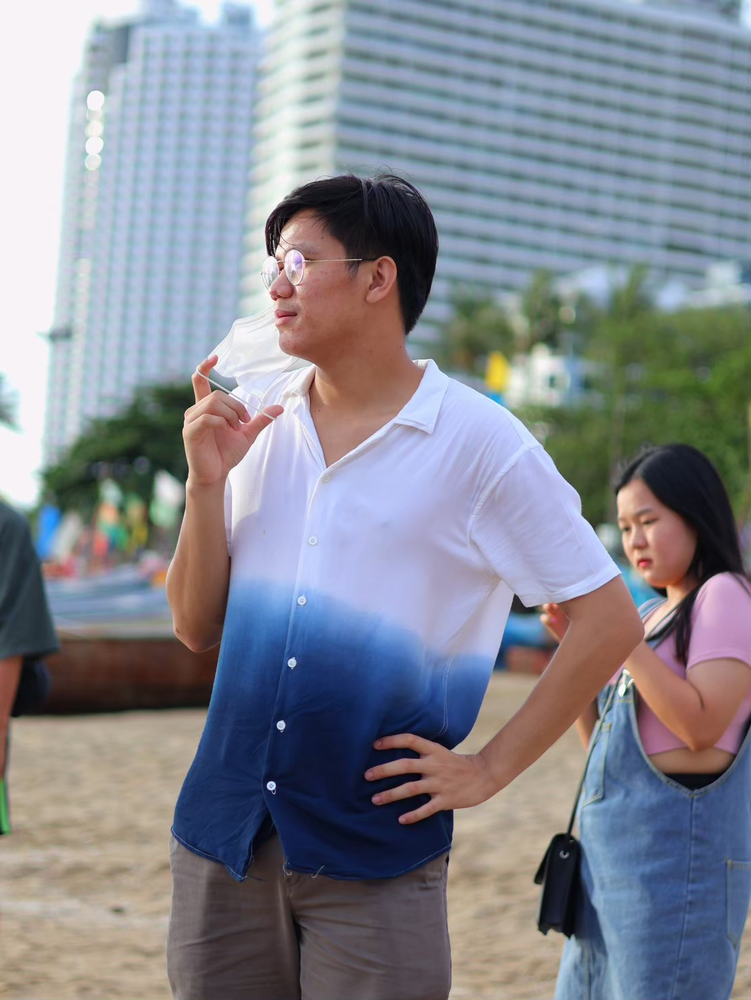

<!DOCTYPE html>
<html lang="en">

<head>
  <meta charset="UTF-8">
  <meta name="viewport" content="width=device-width, initial-scale=1.0">
  <link href="assets/img/favicon.png" rel="icon">
  
  <link rel="stylesheet" href="https://cdnjs.cloudflare.com/ajax/libs/font-awesome/6.2.1/css/all.min.css">
  <link rel="stylesheet" type="text/css" href="./web/style.css">
  <title>Arduino Project</title>
</head>

<body>
  <header id="about">
    <nav id="navbar">
      <ul>
        <li><a href="#about"><i class="fa-solid fa-house"></i></a></li>
        <li><a href="#project-des"><i class="fa-regular fa-folder-open"></i></a></li>
        <li><a href="#video"><i class="fa-solid fa-play"></i></a></li>
        <li><a href="#members"><i class="fa-solid fa-user"></i></a></li>
      </ul>
    </nav>
    

      <h1 id="title">
Hello 👋, Teacher
</h1> 
      
<em>Let's see our project !</em>

    

  </header>

  <section id ="project-des">
    

      <h1>PROJECT DESCRIPTION</h1>
        </image>
          
โปรเจ็กต์ของพวกเราได้มีการพัฒนาด้วยภาษา Arduino ซึ่งมีโครงสร้างมาจากภาษา C  และมีการผสมร่วมกันกับภาษา Python ในการทำ Face Recognition :)
 
          
โดยตัวภาษา C นั้นจะเป็นระบบแสดงผลที่มี LCD module เป็นจอในการแสดงผลขนาด 16x2

          </image>
          
มีการใช้ Ultrasonic ในการตรวจจับคลื่นสะท้อนว่ามีวัตถุเคลื่อนผ่านเซนเซอร์หรือไม่

          </image>
          
และ LED ที่ใช้ในการจำลองการแสดงผลว่าสแกนเสร็จสิ้นแล้วหรือไม่

          </image>
          
- - - - - - - - - - - - - - - - - - - - - -
           ซึ่งระบบจะมีการทำงานเป็นขั้นตอนดังนี้
           - - - - - - - - - - - - - - - - - - - - - -
           1.ผู้ใช้ได้เพิ่มรูปภาพใบหน้าของตนเข้าไปเก็บไว้ในระบบ
           2.เมื่อผู้ใช้เดินผ่าน Ultrasonic จะทำการตรวจจับวัตถุที่ผ่านเซนเซอร์
           3.เมื่อผู้ใช้ทำการสแกนใบหน้าจะมีการตรวจเช็คว่าตรงกับข้อมูลที่เก็บไว้หรือไม่
           4.LCD module แสดงข้อความต้อนรับ และ LED จะกระพริบจากสีแดงกลายเป็นสีน้ำเงินเป็นเวลา 2 วินาที

         
    

  </section>

  <section id ="video">
    

      <h3>DEMO</h3>
      <iframe class="youtube_frame" src="https://www.youtube.com/embed/E2YlqAT0WgU" allowfullscreen></iframe>
    

  </section>

  <section id = "members"> 
    <h3>MEMBERS</h3> 
              

                
                

 Phowadol  Sriphanna 

                
65070182

                
                

 Rawipon Sa-ardpothong 

                
65070197

                
                

 Siriwit Maneeshine 

                
65070215

                
                

 Atikun Pitsayo 

                
65070247

              

  </section>
</body>
</html> 
